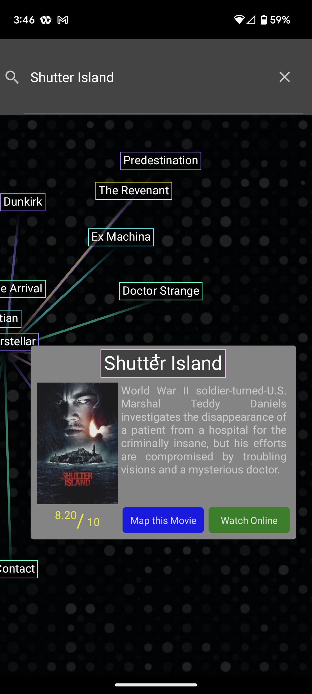
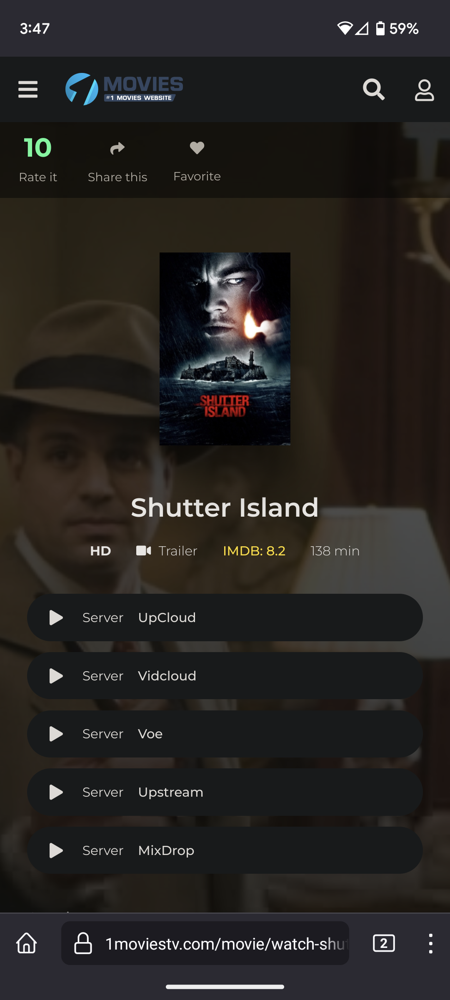

<p align="center">
  <h1 align="center">MovieGPT</h1>
</p>

&nbsp;&nbsp;&nbsp;&nbsp;&nbsp;&nbsp;


# Project building guide


1. Install Xcode via the App Store
   - Install XCode command line tools
     Run ```xcode-select --install``` in terminal
   - Install Cocoapods
     Run ```sudo gem install cocoapods``` in terminal
2. Install Android Studio
   https://developer.android.com/studio
   - Create A virtual device
    Status bar->Toolds/Avd Manager/Create Virtual Device...
   - Install SDK/Tools
    Status bar->Toolds/SDK Manager
    1) Tap SDK Platforms
     Select Android 8.0~Android S Preview and Click "Ok"
    2) Tap SDK Tools
     Select and install following tools
     - Android SDK Build-Tools
     - NDK
     - Android SDK Command-line Tools
     - Android Emulator
     - Android SDK Platform-Tools
     - Google Play services
     - Intel x86 Emulator Accelerator (HAXM installer)


3. Install Homebrew:
   ```
   ruby -e "$(curl -fsSL https://raw.github.com/Homebrew/homebrew/go/install)"
   ```

4. Install Android dev tools using Homebrew
  ```
   brew install --cask android-sdk
   brew install --cask homebrew/cask-versions/adoptopenjdk8
   brew doctor
   brew install ant
   brew install maven
   brew install gradle
   brew install android-sdk
   brew install android-ndk
   ```

5. Install React Native CLI

   Reference: https://reactnative.dev/docs/environment-setup

   ```brew install node```

   ```brew install watchman```

   ```npx react-native init Example```

   You can delete Example project.

6. Open our project on visual studio code
   - To run iOS, select a simulator on Xcode and click "Run" button.

      Or you can build using command line :

      ```npm i```

      ```cd ios && pod install```

      ```npm run ios```

    
   - To run Android, launch a emulator (virtual device)
    Run ```npm run android``` in the terminal.


Note:
- No toolchains found in the NDK toolchains folder for ABI with prefix: arm-linux-androideabi


Please check following folder.

```/Users/username/Library/Android/sdk```

If there is a "ndk" folder, then rename to "ndk-bundle"


# DeTox Test Guide

1. iOS
  - Launch iPhone 11 Pro Max simulator
  - Run ```npm run e2e:ios``` in terminal
Then, after building by detox, you will see testing on iPhone 11 Pro Max

2. Android
- Launch  Pixel_3a_API_30  emulator
- Run ```npm run e2e:android``` in terminal

If you want to change the emulator or simulator for testing, then you need to update device.type parameter in .detoxrc.json.
Also, you can see the available emulators and simulators with command line-```npm run emulators``` and ```npm run simulators```


